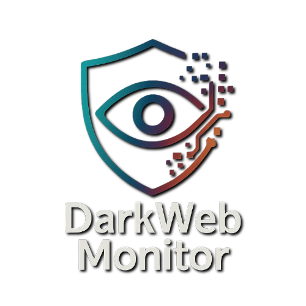
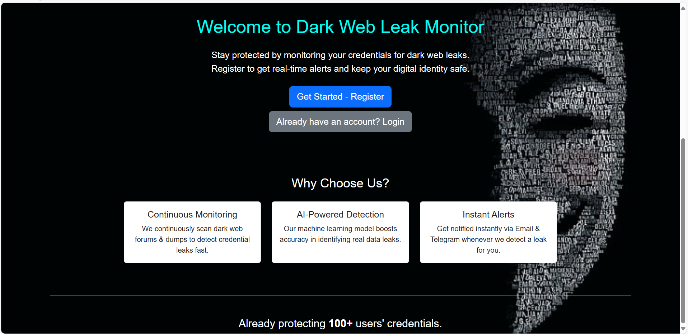
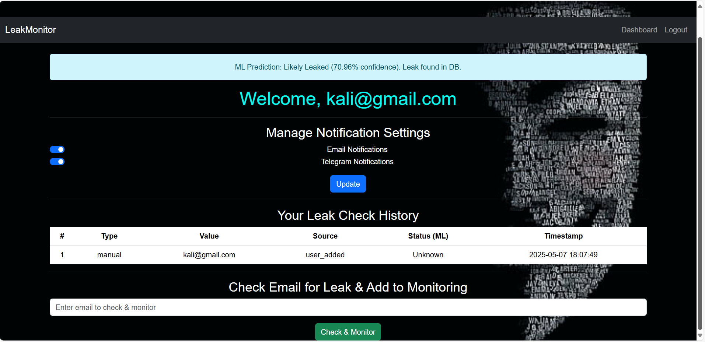

```markdown
# Dark Web Monitoring System for Leaked Credentials with ML-UI

A final-year B.Tech cyber security project that scrapes dark web sources (via TOR) for leaked email addresses and credentials. Users can check via a simple web interface if their email has been compromised.

```


## 🔒 Project Overview

**Dark Web Monitoring System for Leaked Credentials with ML-UI** is a cybersecurity tool designed to **detect if user credentials (emails, usernames, passwords) have been leaked on the dark web.** It combines:

- 🕵️ **Dark Web Scraping**
- 🧠 **Machine Learning Prediction**
- 🔍 **Pattern Matching**
- 📢 **Real-time Alerts (Email & Telegram)**
- 🌐 **User-Friendly Web Interface**

This system ensures proactive protection by continuously monitoring dark web sources, alerting users instantly if any of their credentials are found in leaks.

---

## 🚀 Key Features

- **User Registration & Login:**
  - Secure account system to manage your monitoring preferences.

- **Credential Leak Checking:**
  - Manually check if your email has been leaked using AI + pattern matching.

- **Continuous Monitoring:**
  - Automated dark web scraping every 6 hours (configurable).

- **Machine Learning Prediction:**
  - AI model boosts accuracy in identifying real leaks (Logistic Regression + Tfidf).

- **Leak Extraction:**
  - Extracts emails, usernames, and passwords from dark web data using regex patterns.

- **Alerts:**
  - Get notified via Email and Telegram when leaks are detected.

- **Dashboard:**
  - View your personal leak history, ML status, and manage notification settings.

- **Admin Logs:**
  - All scraping and alerting events are logged for transparency.

---

## 🛠️ Tech Stack

- **Backend:**
  - Python, Flask, SQLite
  - APScheduler for periodic scraping
  - scikit-learn (ML)

- **Frontend:**
  - HTML, CSS (Bootstrap + custom styles)
  
- **Scraping:**
  - Tor network via `requests` and `socks`
  - BeautifulSoup (HTML parsing)

- **Notifications:**
  - SMTP (Email)
  - Telegram Bot API

---

## 📸 Screenshots

| Welcome Page                          | Dashboard                                           |
|---------------------------------------|-----------------------------------------------------|
|    |              |

---

## 🔧 Setup & Installation

1️⃣ **Clone the repository:**

```bash
git clone https://github.com/yourusername/darkweb-monitoring-system.git
cd darkweb-monitoring-system
````

2️⃣ **Create a virtual environment:**

```bash
python -m venv venv
source venv/bin/activate  # On Windows: venv\Scripts\activate
```

3️⃣ **Install dependencies:**

```bash
pip install -r requirements.txt
```

4️⃣ **Configure settings:**

* **config.py:** Set your TOR proxy, email settings, Telegram bot credentials.
* Ensure your ML model files (`model.pkl`, `vectorizer.pkl`) are in `/ml_model/`.

5️⃣ **Initialize the database:**

```bash
python app.py  # The DB is auto-initialized on first run.
```

6️⃣ **Run the app:**

```bash
python app.py
```

Visit: [http://127.0.0.1:5000/]

---

## 🔄 Periodic Scraping

The system runs **background scraping every 6 hours** by default using APScheduler. You can change the interval in `app.py`:

```python
scheduler.add_job(periodic_scrape, 'interval', hours=6)
```

---

## 🚨 Security Notes

* Never expose this system directly to the internet without proper security hardening.
* Use **HTTPS** if deploying in production.
* Keep your SMTP & Telegram API keys **secure and private.**

---

## 🙌 Acknowledgments

* Tor network
* scikit-learn
* Flask
* Bootstrap
* BeautifulSoup

---
## Future Scope

- Integrate machine learning for leak pattern prediction
- Real-time alert dashboard
- Scan pastebins and clearnet forums

---

## Disclaimer

For educational and ethical cybersecurity research only. Do not use on real-world dark web platforms without permission and legal clearance.

---

## ✨ Author

👤 **\Lokantik Jain & Kashvi Pandey**

```
B.Tech Final Year Cybersecurity Project
```

